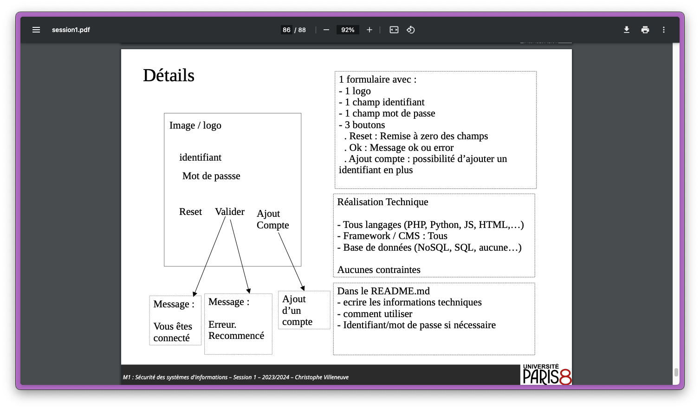

# TP securite m1

Tp réalisé dans le cadre du premier cours de securité des systemes d'informations.

## Informations Techniques

- **Plateforme :** Node.js
- **Framework :** ExpressJS
- **Base de données :** MongoDB
- **Autres dépendances importantes :** Mongoose pour MongoDB, bcrypt pour le hachage des mots de passe, etc.

## Prérequis

Avant de commencer, assurez-vous d'avoir installé :

- Node.js (version 20.11 ou supérieure)
- npm (inclus avec Node.js)
- MongoDB

## Installation

Pour installer et configurer le projet sur votre système local, suivez ces étapes :

1. Clonez le dépôt sur votre machine locale :

```bash
git clone https://github.com/beastboym/webnode.git
cd webnode
```

2. Installez les dépendances du projet :

```bash
npm install
```

## Utilisation

Pour démarrer le serveur :

```bash
npm start
```

Accédez à l'application via un navigateur web à l'adresse suivante :

```
http://localhost:3000
```

### Fonctionnalités

Décrivez brièvement les principales fonctionnalités de l'application. Par exemple :

- Inscription et connexion des utilisateurs.
- Cryptage des mots de passe.
  
